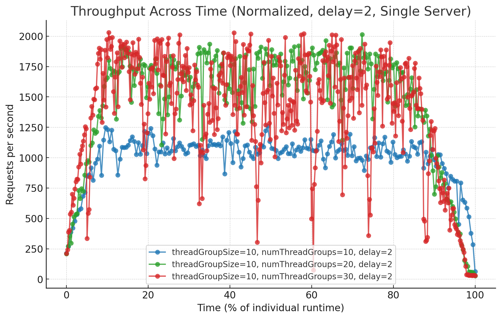
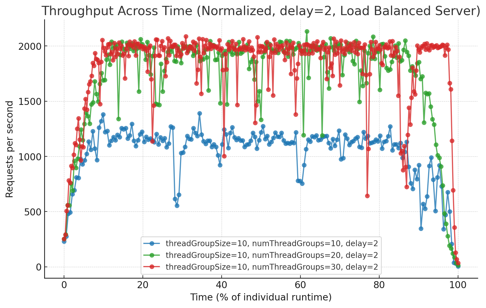
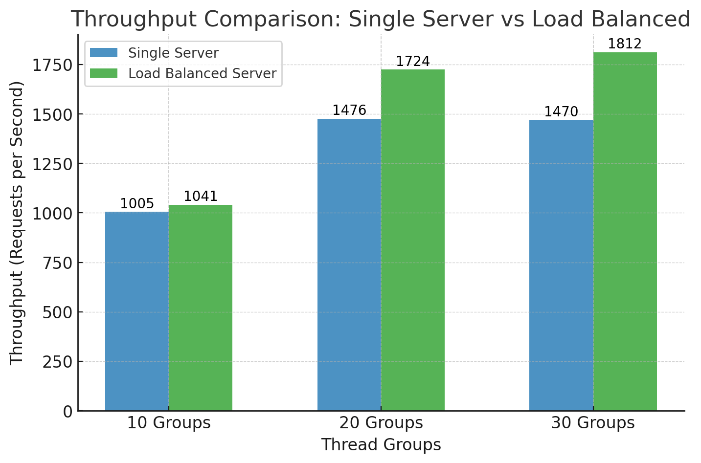
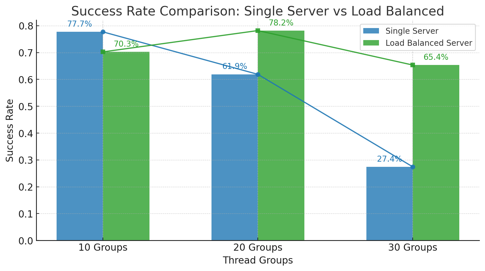
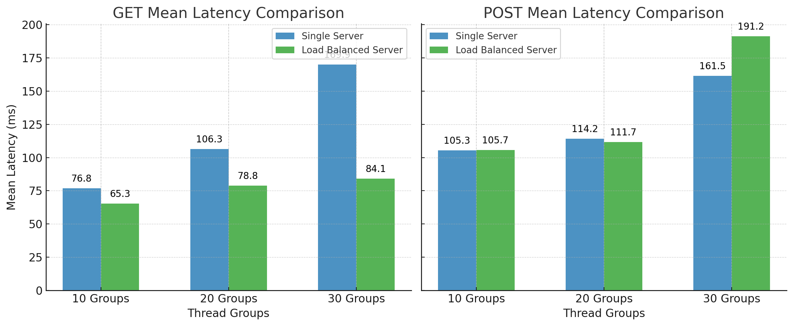
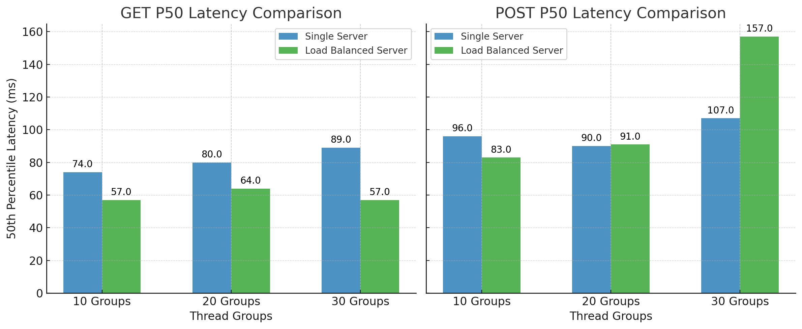
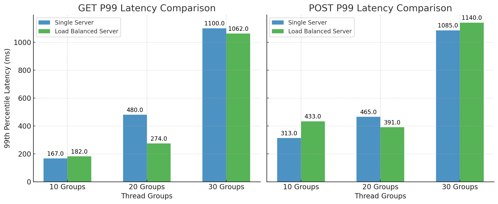

# Project Report

## 1. Data Model
We implemented a **MySQL** database running on AWS RDS, which contains a single table named **Album**.

|Column|Type|Description|
|------|----|-----------|
|id|INT AUTO_INCREMENT PRIMARY KEY|Unique album ID|
|artist|VARCHAR(255) NOT NULL|Artist's name|
|title|VARCHAR(255) NOT NULL|Album title|
|year|INT NOT NULL|Release year of the album|
|image|LONGBLOB NOT NULL|Album cover image in binary format|
|image_size|INT NOT NULL|Size of image file in bytes|

*We used the stock image with a size of approximately 25KB.*

## 2. A Single Server
We used a thread group size of 10 and delay time 2 seconds. 
|Configuration|Single Server - numThreadGroups 10|Single Server - numThreadGroups 20|Single Server -numThreadGroups 30|
|-----------------------------|----------|----------|----------|
|Wall Time(s)                 | 199      |       271|   438     |
|Throughput(request/s)        |   1005   |   1476   | 1369|
|Successful GET Request Number|75412     |113611    |116767 |
|Failed GET Request Number    |24588     |86389     |183233 |
|GET Request Success Rate     |  75.412% |56.806%   | 38.922%|
|Successful POST Request Number|80000    |133938    | 134615|
|Failed POST Request Number   |  20000   |  66062   | 165385|
|POST Request Success Rate    | 80%  | 66.969%  | 44.872%|
|Overall Request Success Rate|77.706%    |61.887%| 41.909%|
|GET Mean Latency            |76.796   |106.28385| 164.518|
|POST Mean Latency         |105.28658 |114.18749|185.239 |
|GET Min Latency           |19          |20     |       20|
|POST Min Latency         |25        |    25|       26 |
|GET Max Latency|1049 |16329|18318 |
|POST Max Latency|1194 |16329| 18318|
|GET 50th Percentile| 74.0|80.0| 81.0|
|POST 50th Percentile| 96.0|90.0| 93.0|
|GET 99th Percentile| 167.0|480.0| 1123.0|
|POST 99th Percentile|313.0 |465.0| 1142.0|

## 3. Two Load Balanced Servers
We used a thread group size of 10 and delay time 2 seconds. 
|Configuration|Load Balanced Server - numThreadGroups 10|Load Balanced Server - numThreadGroups 20|Load Balanced Server -numThreadGroups 30|
|-----------------------------|----------|----------|----------|
|Wall Time(s)                 | 192      |       232|   331     |
|Throughput(request/s)        |   1041   |   1724   | 1812|
|Successful GET Request Number|67193     |149234    |191740 |
|Failed GET Request Number    |32807     |50766     |108260 |
|GET Request Success Rate     |  67.193% |74.617%   | 63.913%|
|Successful POST Request Number|73314    |163533    | 200377|
|Failed POST Request Number   |  26686   |  36467   | 99623|
|POST Request Success Rate    | 73.314%  | 81.767%  | 66.792%|
|Overall Request Success Rate|70.254%    |78.192%| 65.353%|
|GET Mean Latency            |65.30091   |78.815655| 84.058603|
|POST Mean Latency         |105.68013 |111.683405|191.24366 |
|GET Min Latency|16 |16| 16|
|POST Min Latency|23 |25|22 |
|GET Max Latency|1235 |15211|16296 |
|POST Max Latency|1668 |15361| 16584|
|GET 50th Percentile| 57.0|64.0| 57.0|
|POST 50th Percentile| 83.0|91.0| 157.0|
|GET 99th Percentile| 182.0|274.0| 1062.0|
|POST 99th Percentile|433.0 |391.0| 1140.0|

## 4. Optimized Server Configuration

## 5. Comparisons

### Single Server vs. Load Balanced Servers

Comparing **throughput** across time and throughput per second charts below, we notice load balanced servers have the following advantages:
- Higher throughput
- More stability in throughput
- Scalability with increasing load
- Smoother decline at the end

Observation towards **success rate** comparison:
- As load increases, success rate drops for both setups.
- However, load balanced server handles heavy stress better and maintains higher success rates than the single server.
  

Regarding **request latency**, we observed load-balanced servers
- improve performance for GET requests, but
- introduce additional delay for POST requests

Our current assumption is that the bottleneck in the load-balanced setup stems from the database read process, which may be impacting write operations. Further analysis is needed to determine whether optimizing database indexing, connection pooling, or caching mechanisms could mitigate this delay.

## 6. Future Work

We also observed that storing the album cover images in an S3 bucket could potentially reduce request times by offloading storage and retrieval operations from the database. However, due to time constraints, we were unable to conduct a detailed performance evaluation to quantify the impact. Future work could include benchmarking the request times with and without S3 integration to assess its effectiveness in improving overall system performance.
